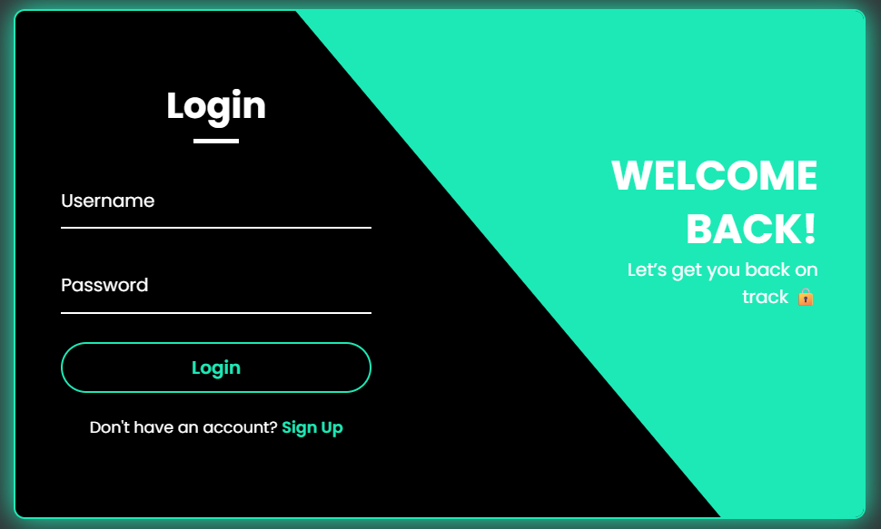

# 💼 Responsive Login & Registration UI

A fully responsive and animated login/registration form built using **HTML**, **CSS**, and **JavaScript**. This interface provides a seamless toggle between login and sign-up forms with modern design elements and smooth transitions.

---

## ✨ Features

- Responsive layout
- Animated transitions between login and registration
- Clean, modern UI design
- Custom themes with CSS variables
- Icon support via Boxicons CDN

---

## 📸 Screenshots

### 🔐 Login Form

### 📝 Registration Form

---

## 🛠️ Tech Stack

- HTML5
- CSS3 (Flexbox, transitions, variables)
- JavaScript (vanilla)
- Boxicons (via CDN)

---

## 📂 Project Files

- `index.html` – Structure of the form
- `style.css` – Styling and layout
- `script.js` – Toggle logic for login/register forms

---

